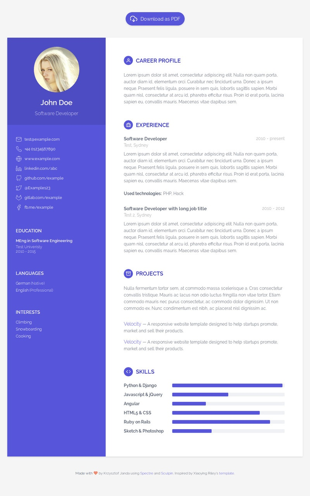

# Jupiter - Responsive Resume/CV template

[](http://www.w3.org/html/logo/)

[](http://creativecommons.org/licenses/by/3.0/)



## Details
Jupiter is a free resume/CV template inspired by [Orbit](https://github.com/xriley/Orbit-Theme). The final HTML is generated by Sculpin - very cool static site generator available by Composer. The project has also possibility of generating PDF file, which can be downloaded directly from your online resume.

It **does not** come with predefined color schemes, since **you can do your own** scheme by changing `$primary-color` in `assets/css/_variables.scss`. All SCSS files are included, so it is quick and easy to change anything in the template. Only the sky is the limit.

## Installation
```bash
$ git clone https://github.com/terenaa/sculpin-jupiter-theme resume
$ cd resume
$ composer install
```

## Generating resume
After installing the theme successfully it requires a few more steps of configuration.

### Configuring
Open `app/config/sculpin_site_prod.yml`. This is the file where all your details will be placed. You can see an **example** in `app/config/sculpin_site_dev.yml`.

Leave imports at the beginning of the file.

Additionally, you can switch **PDF generation** in `app/config/sculpin_kernel.yml`. By default it is **off**, since this option requires [wkhtmltopdf](https://wkhtmltopdf.org/) installed.

```yaml
sculpin_snappy:
  pdf:
    enabled: false
```

### Generating
```bash
$ vendor/bin/sculpin generate --env=prod
```

After generating successfully deploy content of `output_prod` directory.

## Features
* Fully responsive
* HTML5 + CSS3
* PDF generator included
* Built on Spectre 0.5.1
* SCSS files included
* Compatible with all modern browsers
* Microdata

## Contributing

Did you found a bug or got an idea? Feel free to use the [issue tracker](//github.com/terenaa/sculpin-jupiter-theme/issues). Or make directly a [pull request](//github.com/terenaa/sculpin-jupiter-theme/pulls).

## Author & license
The original Bootstrap template is made by UX/UI designer [Xiaoying Riley](https://twitter.com/3rdwave_themes) under the [Creative Commons Attribution 3.0 License (CC BY 3.0)](http://creativecommons.org/licenses/by/3.0/). This Spectre version, made by Krzysztof Janda, is close vision of the original one.

## Credits
* [Sculpin](https://sculpin.io/)
* [Spectre](https://picturepan2.github.io/spectre/)
* [Feather icons](https://feathericons.com/)
* [Original Xiaoying Riley's template](https://themes.3rdwavemedia.com/bootstrap-templates/resume/orbit-free-resume-cv-template-for-developers/)
